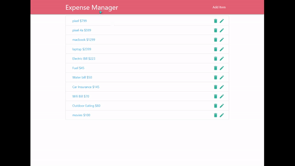

# Expense Manager

**Expense Manager** is a simple web application built with **Node.JS,Express,Materialize** and **MongoDB**. User can add the items of their interest along with price and the information is stored in MongoDB. User can perform the basic **CRUD (Create/Read/Update/Delete) operations** successfully.





## Expense Manager application with Docker Conatiner

You can try this application on your local machine using Docker Container by following the below steps

### Installation


```javascript

    // clone the application with git clone

    // then install the npm modules using
     
    npm install


```


### Running the application


```javascript


    node app.js


```


### Building Docker image

:warning: You should have Docker installed on your local machine 

```bash

    docker build -t <imagename:version> .

```


### Running docker container


```bash

    // Use a port number eg. 3005 at <outside-port>
    docker run -it -d -p <outside-port>:3000 <imagename:version>

```


